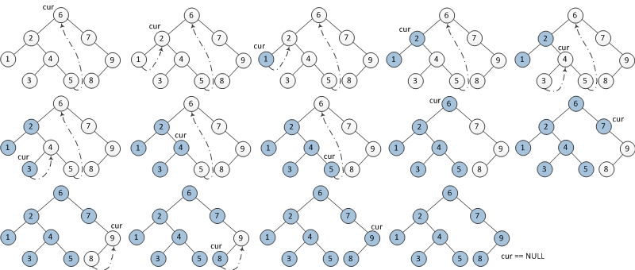
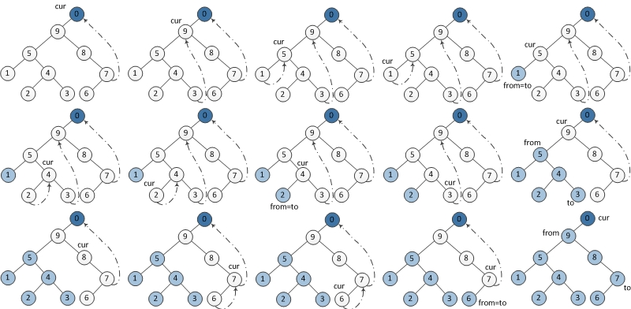

+++
date = '2026-01-18T01:04:46+05:30'
draft = false
title = 'Morris traversal'
description = 'Morris binary tree traversal algorithm'
tags = ['data structures', 'trees', 'algorithms']
+++

Apparently, there is a non-recursive binary tree traversal algorithm that uses
O(1) extra space, called Morris traversal. Let's say our tree node is defined as:

```cpp
struct Node {
    int val;
    Node* left;
    Node* right;
};
```

## Inorder Traversal

The algorithm goes like this:

- If the left child of the current node is null, output the current node's value
  and move to the right child.
- If the left child is not null, find the inorder predecessor of the current
  node
  - If the right child of the predecessor is null, set it to point to the current
    node, and move to the left child of the current node.
  - If the right child of the predecessor is the current node, set it back to
    null, output the current node's value, and move to the right child of the
    current node. This step occurs when we have finished traversing the left
    subtree and are back at the current node.
- Repeat until all nodes are processed.

The following image illustrates the algorithm



A quick C++ implementation:

```cpp
void morris_inorder(Node* root) {
    Node* curr = root;

    while (curr) {
        if (curr->left == nullptr) {
            std::cout << curr->val << " ";
            curr = curr->right;
        } else {
            // Find inorder predecessor
            Node* pred = curr->left;
            while (pred->right != nullptr && pred->right != curr) {
                pred = pred->right;
            }

            if (pred->right == nullptr) {
                pred->right = curr;
                curr = curr->left;
            } else {
                // Restore the tree
                pred->right = nullptr;
                std::cout << curr->val << " ";
                curr = curr->right;
            }
        }
    }
}
```

## Preorder Traversal

The algorithm for preorder traversal is essentially the same, the only
difference being that before moving to the left child, we output the current
node's value.


C++ implementation:

```cpp
void morris_preorder(Node* root) {
    Node* curr = root;

    while (curr) {
        if (curr->left == nullptr) {
            std::cout << curr->val << " ";
            curr = curr->right;
        } else {
            // Find inorder predecessor
            Node* pred = curr->left;
            while (pred->right != nullptr && pred->right != curr) {
                pred = pred->right;
            }

            if (pred->right == nullptr) {
                std::cout << curr->val << " ";
                pred->right = curr;
                curr = curr->left;
            } else {
                // Restore the tree
                pred->right = nullptr;
                curr = curr->right;
            }
        }
    }
}
```

## Postorder Traversal

Postorder traversal is a bit trickier. The idea is that when we find that the
right child of the predecessor points to the current node, we output the nodes
starting from the left child of the current node to the predecessor in reverse
order. This will visit the "root" nodes after their subtrees have been visited.



C++ implementation:

```cpp
void reverse_path(Node* start, Node* end) {
    if (start == end) {
        return;
    }

    Node* prev = start;
    Node* curr = start->right;

    while (prev != end) {
        Node* next = curr->right;
        curr->right = prev;
        prev = curr;
        curr = next;
    }
}

void print_reverse(Node* start, Node* end) {
    reverse_path(start, end);

    Node* curr = end;
    while (true) {
        std::cout << curr->val << " ";
        if (curr == start) {
            break;
        }
        curr = curr->right;
    }

    reverse_path(end, start);
}

void morris_postorder(Node* root) {
    // Dummy parent ensures the root's left subtree is printed. Postorder prints
    // when restoring links, but root has no parent link to restore.
    Node dummy;
    dummy.left = root;
    Node* curr = &dummy;

    while (curr) {
        if (curr->left == nullptr) {
            curr = curr->right;
        } else {
            // Find inorder predecessor
            Node* pred = curr->left;
            while (pred->right != nullptr && pred->right != curr) {
                pred = pred->right;
            }

            if (pred->right == nullptr) {
                pred->right = curr;
                curr = curr->left;
            } else {
                // Restore the tree and print the reverse path
                print_reverse(curr->left, pred);
                pred->right = nullptr;
                curr = curr->right;
            }
        }
    }
}
```

---

## References

- [Annie Kim's blog: Morris Traversal](https://www.cnblogs.com/AnnieKim/archive/2013/06/15/morristraversal.html)
